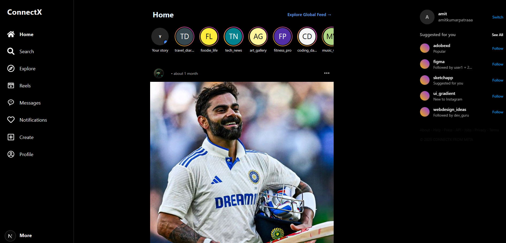

# 🚀 ConnectX




**ConnectX** is a modern, fast, and interactive social media platform built to provide a clean and high-performance social experience. Connect, share, chat, and explore with ease.

## 🌐 Features

### 🔐 Authentication
*   **Secure Login/Signup**: Robust validation and error handling.
*   **Credential Authentication**: Email and password login via NextAuth.
*   **Session Management**: JWT & session-based security.

### 📝 User Features
*   **Create Posts**: Share your thoughts and media.
*   **Interact**: Like, comment, and save posts.
*   **User Profiles**: Customizable profiles with bios and stats.
*   **Follow System**: Connect with other users to populate your feed.

### 🏡 Feed & Discovery
*   **Personalized Feed**: Content from people you follow.
*   **Explore**: Discover trending posts and new connections.

### 💬 Messaging (Coming Soon)
*   **Real-time Chat**: 1-on-1 messaging capabilities.

## ⚙️ Tech Stack

*   **Framework**: [Next.js 14+](https://nextjs.org/) (App Router)
*   **Database**: [MongoDB](https://www.mongodb.com/) with [Mongoose](https://mongoosejs.com/)
*   **Styling**: [Tailwind CSS](https://tailwindcss.com/)
*   **Authentication**: [NextAuth.js](https://next-auth.js.org/)
*   **Icons**: [React Icons](https://react-icons.github.io/react-icons/)

## 🚀 Getting Started

Follow these steps to set up the project locally.

### Prerequisites

*   **Node.js**: Ensure you have Node.js installed (v18+ recommended).
*   **MongoDB**: A local or cloud MongoDB instance (e.g., MongoDB Atlas).

### Installation

1.  **Clone the repository**
    ```bash
    git clone https://github.com/your-username/ConnectX.git
    cd ConnectX
    ```

2.  **Install dependencies**
    ```bash
    npm install
    # or
    yarn install
    ```

3.  **Configure Environment Variables**
    Create a `.env.local` file in the root directory and add the following variables:

    ```env
    MONGODB_URI=mongodb+srv://<your-db-connection-string>
    NEXTAUTH_SECRET=your-super-secret-key-openssl-rand-base64-32
    NEXTAUTH_URL=http://localhost:3000
    ```

4.  **Run the development server**
    ```bash
    npm run dev
    ```

    Open [http://localhost:3000](http://localhost:3000) with your browser to see the result.

## 📂 Project Structure

```bash
src/
├── app/
│   ├── api/            # Backend API routes
│   ├── create-post/    # Post creation page
│   ├── explore/        # Explore page
│   ├── login/          # Authentication pages
│   ├── messages/       # Chat interface
│   ├── notifications/  # User notifications
│   ├── profile/        # User profile pages
│   ├── register/       # User registration
│   ├── search/         # Search functionality
│   ├── globals.css     # Global styles
│   ├── layout.js       # Root layout
│   └── page.js         # Landing/Home page
├── lib/
│   └── db.js           # Database connection helper
├── models/             # Mongoose data models
└── components/         # Reusable UI components
```

## 🤝 Contributing

Contributions are welcome! Please feel free to submit a Pull Request.

1.  Fork the project
2.  Create your Feature Branch (`git checkout -b feature/AmazingFeature`)
3.  Commit your changes (`git commit -m 'Add some AmazingFeature'`)
4.  Push to the Branch (`git push origin feature/AmazingFeature`)
5.  Open a Pull Request

## 📞 Contact

**Start your Journey** - [Your Website/Profile Link]
